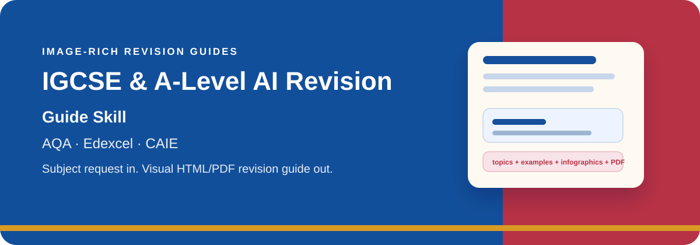
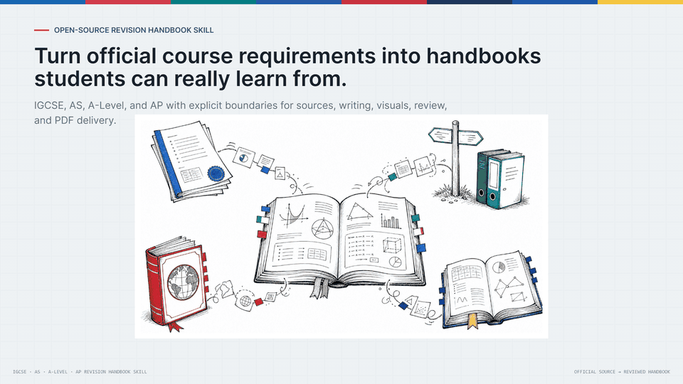

# IGCSE & A-Level AI Revision Guide Skill

<p align="center">
  
</p>

## What This Project Is

**This is a framework, not a content generator.** The Skill provides the
scaffolding — syllabus parsing, HTML/PDF rendering, visual asset management,
multi-role orchestration contracts — but the actual concept explanations and
worked-example wording are produced by **the LLM that runs this Skill**:

- When the Agent host (OpenClaw / Hermes / Claude / etc.) loads this Skill,
  the host's LLM plays the **Writer** role: it writes original concept
  explanations for each topic from its own knowledge, in the requested style.
- The host's LLM also plays the **Analyst** role: it reads both the official
  Markdown companion (`source/specification.md`) and page-level evidence
  (`syllabus-evidence.json`), decides the real topic boundaries and exam
  points, and writes the authoritative `syllabus-outline.json`. Python only
  collects page evidence and invokes external MarkItDown for structure-readable
  Markdown; it does **not** decide topics or exam points on its own.
- The host's LLM then performs the **Reviewer** role as a separate review pass:
  the Reviewer reads the rendered handbook/PDF and source evidence without
  treating the Writer's validation as approval, then checks for teaching
  effectiveness, blank pages, duplicate mastery text, misused visuals, or
  gap-to-source issues. This may be a separate Agent if the user requests
  multi-agent delegation, but it is not mandatory.

The Python package under `src/intl_exam_guide/` provides:

- Provider adapters that fetch official OxfordAQA / Pearson Edexcel /
  Cambridge International qualification pages and PDFs, extract page-level evidence,
  and create a mandatory MarkItDown Markdown companion for official PDF workflows
  without adding MarkItDown to the main package dependencies.
- HTML and PDF rendering of the three-role output.
- Validation and quality gates (`scripts/import_concept_explanations.py`,
  `scripts/import_infographic_assets.py`).
- A **CLI-only fallback** (`python -m intl_exam_guide generate …`) that
  produces an evidence package without the LLM Analyst outline pass. The
  CLI fallback is for testing or for environments where no Skill host is
  available. The output stays at `draft/evidence-ready` and cannot be
  presented as `final-ready`. **Run the Skill through an LLM agent to get a
  teaching-grade handbook.**

## Why This Skill Exists

This project began at home. My son is taking his International GCSE exams this
year after moving from a Chinese public-school path into an international
curriculum. In less than a year, the classroom language shifted from Chinese to
English, while the exam clock kept moving.

I used AI to build a study and revision Skill: take the course requirements,
break knowledge into understandable structures, worked examples, diagrams, and
checkpoints. The goal is not to let AI learn for a child. The goal is to lower
the noise around learning so students can face schoolwork with more calm and
control.

<p align="center">
  <a href="https://mianbaofang.github.io/igcse-a-level-revision-guide/project-intro-animation-en.html">
    
  </a>
</p>

<p align="center">
  <a href="README.zh-CN.md">中文 README</a>
  ·
  <a href="https://mianbaofang.github.io/igcse-a-level-revision-guide/">Project site</a>
  ·
  <a href="https://mianbaofang.github.io/igcse-a-level-revision-guide/project-intro-animation-en.html">HTML intro</a>
  ·
  <a href="docs/index.html">Project details</a>
  ·
  <a href="docs/release-evidence/README.md">Release evidence</a>
  ·
  <a href="skill/references/revision_guide_spec.md">Handbook spec</a>
</p>

An AI Skill for generating image-rich, printable International GCSE and
International AS-A-level revision handbooks from official exam-board sources.

This version is built around the three exam boards most relevant to mainland
China international-school usage:

| Exam board | Current support |
|---|---|
| AQA | Discovers qualifications from OxfordAQA / Oxford International AQA public pages and reads the public specification PDF. |
| Edexcel | Tries official Pearson Edexcel subject-page candidates from the subject name; falls back to a supplied official subject page or direct specification PDF URL. |
| CAIE | Searches official Cambridge International subject indexes for candidates; falls back to a supplied official subject page or direct syllabus PDF URL; asks for the exam year when several ranges are listed. |

It uses one shared handbook workflow across the three boards: read the official
syllabus, expand it into teachable topic units, write reviewed concept
explanations from the current topic/source points, create worked examples,
decide which points need visuals, and deliver HTML/PDF output.

The workflow is a lightweight three-role process: Analyst, Writer, and Reviewer.
Those names are operating roles, not mandatory separate agents; one host LLM can
run them step by step unless the user explicitly chooses multi-agent delegation.
The Reviewer still has to open the visible handbook/PDF and cannot treat machine
validation as approval. The review includes source traceability, notation spot-checks,
and cross-page visual repetition checks so repeated image layouts or code-style
maths do not slip into the student edition. Supporting evidence is written to
`delivery-contract.json` and `final-review-packet.json`.

Delivery quality claims are tracked in the delivery matrix at
`tests/fixtures/delivery_matrix.json`. Each route has an explicit claim status
and a v0.5 release-evidence status. Candidate routes must not be described as
release-ready until a fresh output passes validation, final review, product
review, and visual-status checks. The shared workflow is three-board, but the
matrix evidence defines what is currently deliverable.

v0.5 status words are intentionally conservative:

- `candidate`: route evidence exists, but it is not delivery-grade.
- `draft`: a fresh output exists, but concepts, visuals, PDF, validation, or
  self-review still block final handoff.
- `final-ready`: current evidence says the output can be handed off after
  validation, final review, and asset/status checks.
- `certified`: final-ready evidence has also been reviewed and approved for a
  release. No current route should be called certified unless the
  release-evidence manifest says so.

## Quick Start

Most users do not need to install Python or run commands. Give this Skill link
to your OpenClaw, Hermes, or other Skill-compatible Agent:

```text
https://github.com/mianbaofang/igcse-a-level-revision-guide/tree/main/skill
```

Then ask:

```text
Install this Skill, then generate an AQA Chemistry International GCSE revision handbook with a Simplified Chinese term glossary and export it as PDF.
```

Typical requests:

```text
Generate an Edexcel Accounting International GCSE revision guide.
Generate a Cambridge IGCSE Economics guide for the 2027 exam year with a Japanese term glossary.
Generate an AQA Mathematics 9260 revision handbook with visual worked examples and final review questions.
```

Before generation starts, the Agent should confirm:

1. Exam board, qualification level, subject, code, and official URL when needed.
2. Exam year when the official page lists multiple syllabus ranges.
3. Term-support language: `en` for no glossary, or a support language such as
   `zh-CN`, `zh-TW`, or `ja` for a 30-50 item professional term glossary. The
   handbook body, examples, labels, and visual prompts stay in English.
4. Explanation style: formal, friendly, life-scene, story-based, detective, or
   adventure-style.
5. Workflow mode: explicitly offer default single-host Analyst/Writer/Reviewer
   role passes, or optional multi-agent delegation if the user wants separate
   agents and the host runtime supports them. If the user stays with the default,
   record that choice in the handoff summary.
6. Infographic capability: ask whether the user has a callable image or
   infographic route for this run. If yes, collect the route type, such as an
   installed image-generation Skill, a custom API endpoint plus environment
   variable name, a project script, or an existing generated-asset directory.
   If no, explain that exact SVG/Kroki assets still require an LLM exact-fit
   decision and review, while dense infographics will remain pending; then ask
   whether to continue as a draft-with-pending-images run.

The user should not be forced through a generic image-model menu. The required
early question is whether a callable image route exists at all. After the base
handbook is generated, the Agent reports how many complex infographics are
needed, runs or imports the confirmed route when available, and clearly marks
any unresolved complex visuals as not yet reviewed.

## What It Produces

```text
outputs/chemistry-9202/
  <board>-<level>-<subject>-<time>.html  printable student handbook
  <board>-<level>-<subject>-<time>.pdf   PDF export
  sections/                  modular guide sections for review
  images/                    visual manifest, reviewed assets, and pending jobs
  concepts/                  concept-writing jobs and reviewed explanations
  run-options.json           confirmed subject, language, and explanation style
  guide-plan.json            topic, example, and revision-task plan
  qualification.json         qualification and source metadata
  validation.json            quality-check report
  final-review-packet.json   Agent/LLM final review evidence
  agent-product-review.json  active Agent product-review and repair evidence
  handbook-package.json      final delivery manifest
```

The handbook package includes:

- syllabus-based topic structure;
- student-friendly explanations reviewed from per-topic source jobs;
- original worked examples with steps and answer checkpoints;
- per-topic `visual_decision` records, including `text-ok` reasons when a separate visual would not add learning value;
- reviewed exact-SVG/Kroki/image assets where they fit, plus pending complex-infographic briefs;
- final revision questions;
- printable HTML/PDF output.

Before presenting an output as final, run
`python -m intl_exam_guide review --out <output-dir>` and read
`final-review-packet.json`. Validation is not enough by itself: the Agent must
inspect the rendered excerpt, topic/source summary, worked-example evidence, and
concept/image job status, then label the output as draft or final-ready for
release evidence. A route with only candidate evidence is not delivery-grade.
A base run with pending `concepts/concept_jobs.json` entries is a draft until
reviewed concept explanations are imported.

The user's LLM/Agent must also perform a final product review before handoff:
read the generated handbook as the student will see it, compare the topic
sequence and concept explanations with the syllabus outline, inspect sampled
PDF pages and visuals, and repair fixable problems before giving the file to
the user. The project must not present "the Skill generated it" or "the gate
returned ready" as a substitute for this review-and-repair loop. Record that
pass in `agent-product-review.json`; without complete product-review evidence,
the package remains review-ready or draft even if validation has no errors.

## Preview

| Mathematics | Economics | Chemistry |
|---|---|---|
|  |  |  |

These screenshots demonstrate handbook quality. They are not the subject limit.

## Supported Exam Boards

| Exam board | International GCSE | International AS-A-level | Current behavior |
|---|---:|---:|---|
| AQA | yes | yes | Public catalogue discovery through OxfordAQA / Oxford International AQA pages. |
| Edexcel | yes | yes | Subject-name candidate discovery for common official Pearson Edexcel page patterns; official URL/PDF can override ambiguity. |
| CAIE | yes | yes | Official Cambridge International subject-index candidate discovery; official URL/PDF can override ambiguity; exam year is required for multi-range pages. |
| OCR, WJEC/Eduqas, CCEA, and other UK boards | no | no | Outside the current release scope. |

The current release focuses on AQA, Edexcel, and CAIE. Full official names are
OxfordAQA / Oxford International AQA, Pearson Edexcel, and Cambridge
International. It does not claim support for every UK A-level awarding
organisation.

## Visuals And Writing Styles

A useful handbook cannot be text-only. The workflow has two passes:

1. Build topic explanations and worked examples from the official syllabus.
2. Decide which topics or examples need visual explanation.

The host LLM/Agent decides whether each topic or worked example needs text only,
an exact SVG candidate, or a richer infographic. SVG is allowed only when the
visual meaning is fully carried by exact geometry, axes, labels, simple tables,
or simple flows; the Writer must mark `svg_fit: "exact"`, and the asset must be
reviewed or approved before final delivery. Richer items become visual briefs:
lab apparatus, complex geometry, circuits, economics scenes, or text-heavy
educational infographics.

When no callable image model is available, complex visuals remain queued in
`images/infographic_jobs.json` and `images/infographic_jobs.md`. The Python
framework does not create local deterministic SVG stand-ins for those briefs.
Kroki or SVG outputs are treated as reviewed exact-fit assets, not substitutes
for dense infographics.

Recommended external image models include:

- OpenAI GPT Image 2.0;
- Qwen Image 2.0 Pro;
- SenseNova U1 Fast.

These are recommendations, not guaranteed built-in capabilities. Users need to
provide their own callable API, Skill, script, or generated image assets. Images
explain selected syllabus points; they must not introduce unsupported exam
claims.

Writing styles include formal exam prep, friendly explanation, life-scene
analogy, story-based teaching, detective reasoning, and adventure-style study
missions. The default is original framing, not copied protected characters or
worlds.

The writing pass also includes a small anti-template-language gate adapted from
the anti-AI-language ideas in `qiaomu-novel-generator`: it removes safe
formulaic transitions and warns when a guide still sounds like generic AI prose.
This is a design inspiration, not a runtime dependency.

Design inspiration: the anti-template wording check is adapted from
`qiaomu-novel-generator`. The SVG review contract follows the general idea of a
figure contract: define the claim, labels, source evidence, and review risk
before approving an asset. This is documentation guidance, not a runtime
dependency.

## Language Policy

The handbook body is always English because the exams themselves are in
English. The preflight language choice is now a term-support language, not a
translated-body mode:

- `en` means English only, with no glossary.
- `zh-CN`, `zh-TW`, `ja`, or another supported language adds a 30-50 item
  professional glossary mapping the selected language to the official English
  exam terms.
- Student-facing explanations, worked examples, topic labels, diagram text, and
  image prompts remain English.
- The generator should not create a fully translated handbook or sprinkle
  bilingual `Chinese / English` labels through the body.

## Release Notes

Version-by-version update notes live in
[GitHub Releases](https://github.com/mianbaofang/igcse-a-level-revision-guide/releases)
and [CHANGELOG.md](CHANGELOG.md). The README stays focused on what the Skill
does and how users run it.

## Developer Quick Start

Two operating modes exist. Pick the one that matches your environment.

### Mode 1: Skill host (preferred, for production handbooks)

Point your Agent runtime (OpenClaw, Hermes, Claude with subagents, etc.) at
the Skill folder:

```text
https://github.com/mianbaofang/igcse-a-level-revision-guide/tree/main/skill
```

The Agent runtime follows the lightweight Skill workflow:

- **Analyst role**: reads the official syllabus evidence and writes the
  authoritative `syllabus-outline.json` (topic titles, exam points, source
  snippets). Python evidence extraction is a hint, not a substitute.
- **Writer role**: writes concept explanations, worked examples,
  study-roadmap text, and per-topic `visual_decision` records.
- **Reviewer role**: reads the rendered handbook/PDF, compares it with the
  source evidence and outline, and produces `final-review-packet.json` plus
  `agent-product-review.json`.

These are role labels. They may be separate agents in a runtime that supports
that, but the Skill does not require a project-manager agent, a mandatory
quality-inspector agent, or a release-certification workflow.

Re-runs within the same session are idempotent: re-generated topics overwrite
existing handbook-package.json, validation.json, and visual-manifest.json so the
Skill can keep iterating until the Reviewer has inspected the visible handbook.

### Mode 2: CLI-only (no Skill host, evidence package only)

The official CLI run prepares source evidence for the host LLM workflow. It does not split topics, write teaching content, or render the handbook:

```bash
python -m venv .venv
source .venv/bin/activate
pip install -e .
python -m intl_exam_guide generate \
  --query chemistry \
  --level igcse \
  --out ./outputs/chemistry-9202
```

Windows PowerShell:

```powershell
python -m venv .venv
.\.venv\Scripts\Activate.ps1
pip install -e .
python -m intl_exam_guide generate --query chemistry --level igcse --out .\outputs\chemistry-9202
```

The CLI is for fetching official source material and writing `qualification.json`, `syllabus-evidence.json`, and `source/`. A real teaching handbook still requires Mode 1: an LLM Analyst outline, Writer-authored concepts/visual decisions, rendered HTML/PDF, mechanical checks, and visible-handbook review.

Checks:

```bash
python -m pytest --cov --cov-report=term-missing --cov-fail-under=70 -q
python -m ruff check .
python -m compileall -q src tests scripts
python scripts/scan_for_raw_keys.py . ./outputs
```

## Quality Metrics

Version 0.4+ includes a quality metrics system that measures **teaching effectiveness** ("孩子可用"), not just format correctness ("格式正确").

### Measuring Quality

```python
from intl_exam_guide.quality import QualityGate

gate = QualityGate()

# Check handbook quality
report = gate.check(
    concepts=[{"topic": "Photosynthesis", "text": "...", "keywords": [...]}],
    examples=[{"topic": "Photosynthesis", "text": "Step 1: ..."}],
    visuals=[{"topic": "Photosynthesis", "type": "flowchart", "prompt": "..."}],
    practice_items=[{"question": "..."}],
    subject="biology",
)

print(report.summary())

if report.passed:
    print("✓ Quality gate passed - ready for students")
else:
    print("✗ Quality gate failed")
    for issue in report.issues:
        print(f"  - {issue}")
```

### Quality Metrics Measured

| Metric | Threshold | What It Measures |
|--------|-----------|------------------|
| Concept Clarity | 0.85 | Are concepts explained clearly with examples? |
| Example Relevance | 0.90 | Do examples actually demonstrate the concepts? |
| Visual Helpfulness | 0.80 | Do visuals aid understanding (not decoration)? |
| Overall Usability | 0.85 | Can students actually use this to learn? |

See [docs/QUALITY_METRICS.md](docs/QUALITY_METRICS.md) for detailed documentation.

## Repository Layout

```text
src/intl_exam_guide/
  providers/      exam-board source access and parsing
  parsing/        PDF text extraction
  planning/       topic, example, and visual-brief planning
  rendering/      HTML and PDF rendering
  validation/     completeness checks
  quality/        teaching effectiveness metrics
skill/            Agent-facing Skill instructions
docs/             project details, policies, examples, and preview pages
tests/            tests and regression samples
```

## Copyright And Source Policy

Do not commit downloaded official PDFs, past papers, mark schemes, or copied exam
questions. Public samples should use original explanations, original practice
cards, and the minimum source information needed for review.

Families should have subject teachers or syllabus-aware adults review deeper
worked examples before using generated guides as final exam preparation.

## Author

Ethan <ethan.zl@hotmail.com>

## License

MIT.
