# Exam Revision Handbook

**一款面向 AI Agent 的开源复习手册 Skill：基于 AQA、Edexcel、CAIE 与
College Board 官方来源，生成 GCSE、IGCSE、A-Level 与 AP 图文复习手册；先完整
审查 HTML，再按批准版本导出 PDF。**

<table align="center"><tr><td><a href="https://github.com/mianbaofang/exam-revision-handbook/releases/latest"></a></td><td><a href="https://github.com/mianbaofang/exam-revision-handbook/actions/workflows/ci.yml"></a></td><td><a href="LICENSE"></a></td><td><a href="https://github.com/mianbaofang/exam-revision-handbook/stargazers"></a></td></tr></table>

<p align="center">
  <a href="https://mianbaofang.github.io/exam-revision-handbook/project-intro-animation.html">
    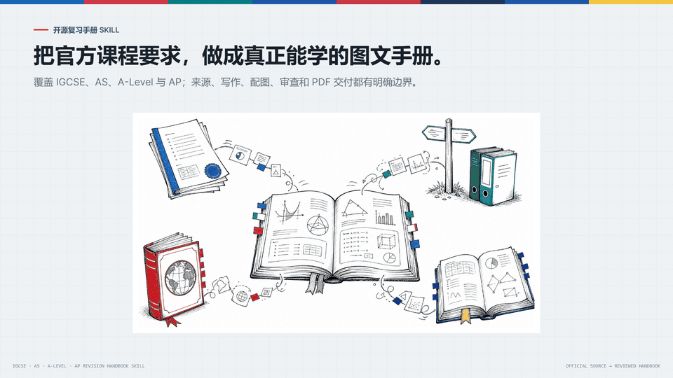
  </a>
</p>

<p align="center">
  <a href="README.md">English</a>
  ·
  <a href="https://mianbaofang.github.io/exam-revision-handbook/">项目主页</a>
  ·
  <a href="https://mianbaofang.github.io/exam-revision-handbook/project-intro-animation.html">介绍动画</a>
  ·
  <a href="docs/index.html">项目详情</a>
  ·
  <a href="docs/release-evidence/README.md">发布证据</a>
  ·
  <a href="DISCLAIMER.md">免责声明</a>
  ·
  <a href="ACKNOWLEDGEMENTS.md">致谢</a>
  ·
  <a href="references/revision_guide_spec.md">手册规范</a>
</p>

## 一分钟开始使用

下载官方
[v0.7.1 Skill ZIP](https://github.com/mianbaofang/exam-revision-handbook/releases/download/v0.7.1/exam-revision-handbook-v0.7.1.zip)，
或者直接把仓库链接交给支持 Skill 的 Agent：

```text
https://github.com/mianbaofang/exam-revision-handbook
```

然后直接说：

```text
请安装这个 Skill，然后生成 AQA International GCSE Chemistry 复习手册，附简体中文专业词对照表，并导出 PDF。
```

| 课程体系 | 当前支持的官方来源 |
|---|---|
| GCSE 与 A-Level | AQA、Pearson Edexcel 英国本土路线 |
| IGCSE 与 International A-Level | OxfordAQA、Pearson Edexcel、Cambridge International / CAIE |
| 美国大学先修课程 AP | College Board Course and Exam Description |

AS 和 A2 是 A-Level 内部阶段。其他课程体系和考试局不能自动获取官方大纲；手动导入
仍是实验性兼容路径。

## 为什么要做这个 Skill

这个项目最早不是为了做一个“工具”，而是为了帮一个真实的孩子轻一点地走过转轨期。
我的儿子今年要参加 International GCSE 大考；他从公办体系转到国际课程还不到一年，
课堂语言几乎一下从全中文切换到全英文。知识点本身可以慢慢学，但新的语言、新的考试方式
和临近大考的时间压力叠在一起，很容易让孩子觉得自己被推着走。

我用 AI 做了一个学习、复习用的 Skill：让它围绕对应课程要求，把知识点拆成能理解的结构、
例题、图解和检查点。这个项目的初衷很简单：不是替孩子学习，而是把学习路上的噪音降下来，
利用人工智能帮助孩子更轻松、更有掌控感地面对学业。

一个给 AI Agent 使用的复习手册 Skill：基于官方课程来源，生成图文并茂、可打印的英国中学课程（GCSE、IGCSE、A-Level）和美国大学先修课程（AP）复习手册，并把 Analyst、Writer、Reviewer 三个角色从来源证据到最终 HTML/PDF 输出都保留下来。

> 使用前请阅读 [免责声明](DISCLAIMER.md)。本项目不隶属于任何考试局，也不代表考试局背书；生成内容必须结合官方来源和教师判断复核。

## 一眼看懂

| 问题 | 回答 |
|---|---|
| 适合谁 | 正在准备 GCSE、IGCSE、A-Level 或 AP 复习手册的家庭、老师和 Agent 用户。 |
| 会生成什么 | 带来源证据的手册包：HTML/PDF、topic 规划、例题、配图决策和复查证据。 |
| Python 包负责什么 | 抓取官方来源证据、渲染输出、管理资产、执行机械验证。 |
| 宿主 LLM 负责什么 | 写大纲结构、教学解释、例题、配图决策和最终产品复查。 |
| 当前来源范围 | AQA、Edexcel、CAIE 与 College Board AP。 |

这里的“支持”特指自动获取英国本土 GCSE、国际 IGCSE、A-Level，以及 College Board
AP 的官方课程大纲。AS 和 A2 都是 A-Level 内部阶段，不是与 A-Level 并列的课程体系。
AQA 和 Edexcel 分别提供英国本土与国际来源路线；CAIE 即 Cambridge International，提供
国际 IGCSE 和 Cambridge International A-Level，而不是一套独立的英国本土 GCSE 产品。
CAIE 的 `uk-domestic` 选择仅记录英国考点请求，仍使用 Cambridge International 官方目录。
其他考试体系或考试局不能使用自动获取功能；手动导入大纲属于未经完整验证的兼容路径，可能出现未知的
解析、提取、元数据或渲染错误。

**这个项目是框架，不是无人值守的离线内容生成器。** 根目录唯一的 `SKILL.md` 及其
`references/` 合同会让
OpenClaw、Hermes 或其它 Agent 的宿主 LLM 按 Analyst、Writer、Reviewer 三个轻量角色工作：
根据当前官方大纲即时判断 topic 边界、写概念解释、例题、学习路线和每个 topic 的
`visual_decision`，再单独复查渲染后的手册。Reviewer 可以是用户明确要求时的独立 Agent，
但不是强制子 Agent。Python 包只负责抓取官方来源、生成 page-level evidence、调用外部
MarkItDown 生成 `source/specification.md`、导出 HTML/PDF、登记图片资产、写入 concept/image jobs
和执行机械验证；Python 不从 Markdown 拆 topic。

CLI 只是框架调试和草稿 fallback。直接运行 `python scripts/run_runtime.py -- generate ...`
会得到结构完整但教学内容偏骨架化的 draft，不能当成已经可交给学生的最终手册。

当前版本自动支持三大英式课程考试局的国际课程和英国本土版路线，并新增 College Board AP 课程体系：

| 考试局 | 当前支持方式 |
|---|---|
| AQA | 国际 IGCSE 和 A-Level 使用 OxfordAQA / Oxford International AQA；英国 GCSE 和 A-Level 使用 AQA 官方科目目录。 |
| Edexcel | 根据预检选择，使用对应的 Pearson Edexcel 国际 IGCSE 或英国 GCSE/A-Level 官方候选页面。 |
| CAIE | 从 Cambridge International 官方科目索引匹配国际 IGCSE 和 Cambridge International A-Level。英国考点选择会保留为可审计的市场元数据，但不代表存在独立的 CAIE 英国本土 GCSE 产品。 |
| College Board AP | 自动发现官网 42 门 AP 科目，只选择核心 Course and Exam Description，校验官方来源，并记录 CED 生效版本与目标考试年份。 |

说明：AQA、Edexcel、CAIE 对应 OxfordAQA / Oxford International AQA、Pearson Edexcel、Cambridge International / CAIE；AP 来源为 College Board 官方 Course and Exam Description。

这套流程面向四个来源体系统一设计：先把官方 PDF 生成 Markdown companion 和 page-level evidence，让 Analyst 同时读两份输入判断结构并保留页码证据，再围绕当前 topic/source points 写出已复查的概念解释，生成例题、图文学习单元、复习题和 PDF。

## 详细使用方法

普通用户不需要安装 Python，也不需要看懂代码。把下面这个 Skill 链接发给你的
OpenClaw、Hermes 或其他支持 Skill 的 Agent：

```text
https://github.com/mianbaofang/exam-revision-handbook
```

直接下载
[v0.7.1 标准 Skill ZIP](https://github.com/mianbaofang/exam-revision-handbook/releases/download/v0.7.1/exam-revision-handbook-v0.7.1.zip)。

然后直接说：

```text
请安装这个 Skill，然后帮我生成 AQA Chemistry International GCSE 复习手册，附中文专业词对照表，并导出 PDF。
```

也可以这样说：

```text
帮我生成 Edexcel Accounting International GCSE 复习手册。
帮我生成 Cambridge IGCSE Economics 2027 考试用复习手册，附日语专业词对照表。
帮我生成 AQA Mathematics 9260 复习手册，需要图文例题和最终复习题。
帮我生成 AP Cybersecurity 2027 考试用复习手册。
```

开始生成前，Agent 应先确认六件事：

1. 考试局、课程阶段、科目和代码，必要时确认官方链接。
2. 考试年份，尤其是 Cambridge 页面同时列出多个年份范围，或 AP CED 存在未来生效版本时。
3. 术语辅助语言：`en` 表示不加对照表；`zh-CN`、`zh-TW`、`ja` 等表示在英文正文基础上增加 30-50 个“用户语言 → English exam term”专业词对照表。手册正文、标签、例题和配图提示仍使用英文。
4. 讲解风格：严谨、轻松、生活化、故事性、侦探推理、闯关式等。
5. 工作流模式：必须明确提示用户可以使用默认的单宿主 LLM 三角色流程，也可以在运行环境支持时选择多 Agent 分工；如果用户选择默认模式，最终交接时要说明这次没有开启独立 subagent。
6. 是否存在本次可调用的信息图/生图路线：已安装 Skill、自定义 API + 环境变量、项目脚本，或已有图片目录。没有可调用路线时，Agent 只能继续生成 draft，并把复杂信息图标记为 pending。

注意：不需要在一开始选择具体生图模型，但第一次预检必须先回答“本次是否有可调用的外部生图 Skill 或工具”。在得到明确回答前，Agent 不得下载来源、写手册或默认使用本地生图。等每个 topic 的配图决策完成后，再报告实际需要生成或复核的复杂视觉 ID。
如果你有可调用的生图 API、Skill、脚本或已经生成好的图片目录，Agent 应调用已确认的路线并自动导入或挂接结果；如果没有，复杂信息图应保留为待生成/待复核任务。SVG 只允许用于 `svg_fit="exact"` 且已复核的精确图。

## 会生成什么

每次生成会输出一个完整手册包：

```text
outputs/chemistry-9202/
  <board>-<level>-<subject>-<time>.html  可预览、可打印的学习手册
  <board>-<level>-<subject>-<time>.pdf   HTML 通过 LLM 审查后导出的 PDF
  sections/                  分章节手册内容，便于 Agent 复查
  images/                    配图清单、已复核资产和待生成任务
  concepts/                  概念解释任务和已复查概念解释
  run-options.json           本次确认的科目、语言和讲解风格
  guide-plan.json            知识点、例题和复习任务规划
      qualification.json         课程与来源信息
      syllabus-evidence.json     官方 PDF page-level evidence
      syllabus-outline.json      Analyst 写出的结构与 topic 拆分
      source/specification.md    MarkItDown 生成的官方 PDF Markdown companion
      source/markdown-extraction.json  Markdown 转换状态和警告
      validation.json            完整性检查结果

  handbook-package.json      最终交付清单
  final-review-packet.json   reviewer 最终复查证据
  agent-product-review.json  当前 Agent 读成品、修复并兜底后的产品复查证据
```

手册内容包括：

- 官方大纲整理出的知识点结构；
- 从每个 topic/source job 复查后的学生友好概念解释；
- 原创例题、步骤和答案检查点；
- 每个 topic 的 `visual_decision`，包括不需要单独图片时的 `text-ok` 理由；
- 已复核的 exact-SVG/Kroki/图片资产和复杂信息图需求清单；
- 最终备考复习题；
- 可打印 HTML，以及审查通过后由门禁命令导出的 PDF。

在把输出当成最终成品交给学生前，可以运行
`python scripts/run_runtime.py -- review --out <output-dir>` 生成辅助诊断，但
`final-review-packet.json` 和 Validation 都不能给出通过结论。当前 LLM Reviewer 必须亲自打开当前 HTML，逐一审查每个最终 topic、定义与关系、教学解释、例题、解题步骤、最终答案、单位、来源锚点，以及每个实际渲染视觉的标签、箭头、位置、结构、比例、单位、说明文字和 topic 对应关系。

发现任何问题都必须返回 Writer 重写源产物、重新渲染 HTML，并从头再次完整查看。只有当前 HTML 没有可修复问题时，LLM 才能写入与该 HTML SHA-256 绑定的 `agent-product-review.json`；随后再运行 `export-pdf`。在此之前不得生成或审查 PDF，也不能标为 final-ready。

只有 candidate 证据的路线不能说成交付级。如果 `concepts/concept_jobs.json` 里还有未导入的概念解释，或复杂信息图还 pending，这份手册只能算 draft。

## 效果预览

### OxfordAQA IGCSE Biology

<table align="center">
  <tr>
    <td>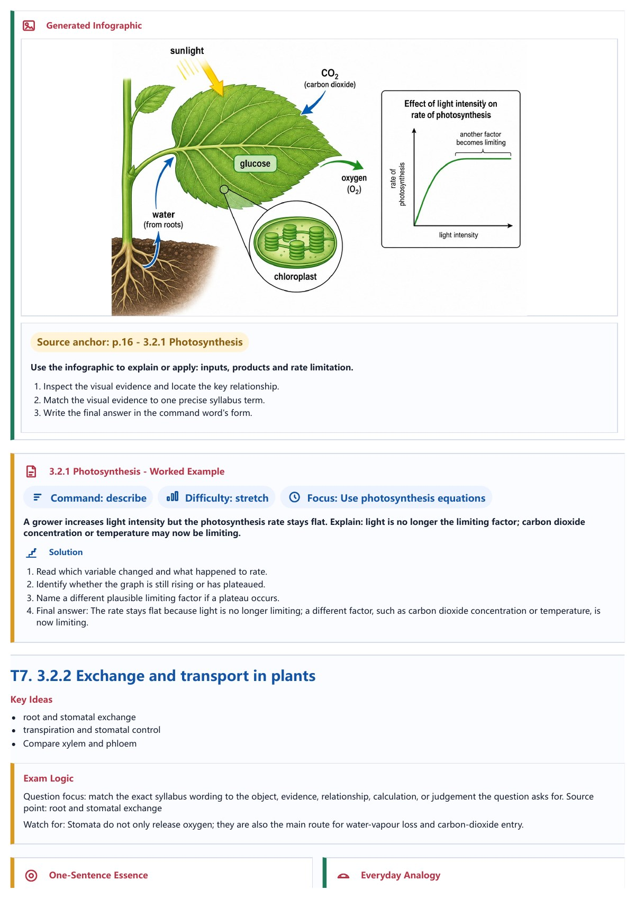</td>
    <td>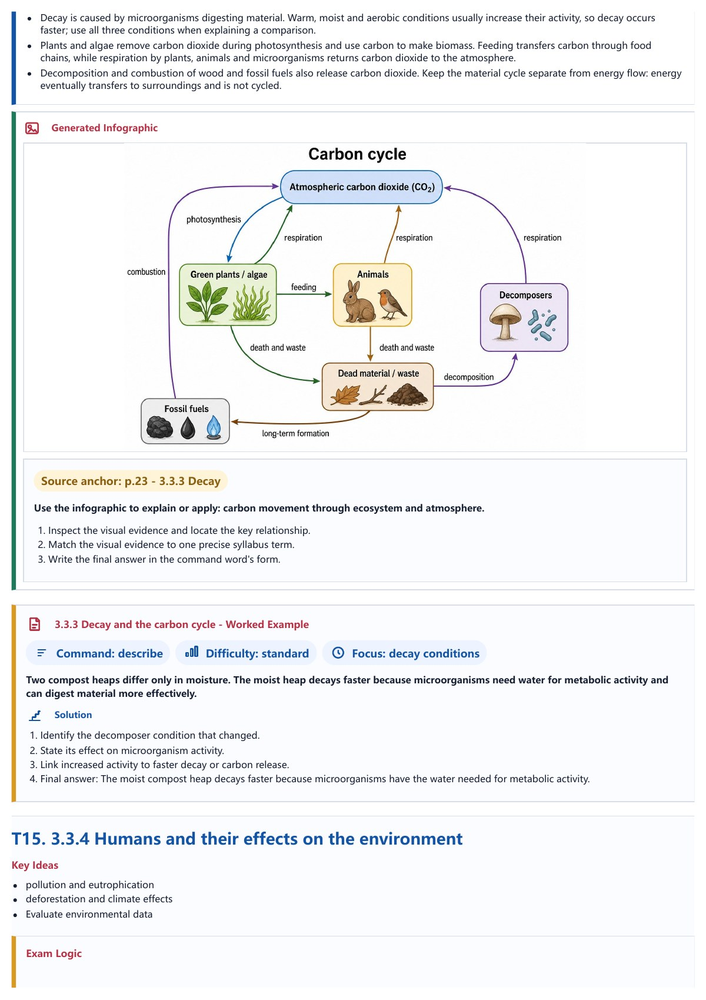</td>
    <td>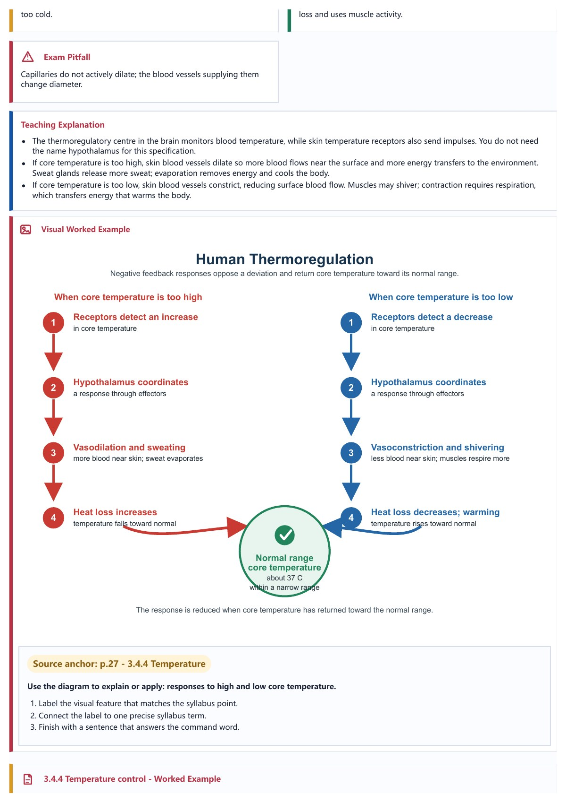</td>
  </tr>
</table>

### CAIE AS Physics

<table align="center">
  <tr>
    <td>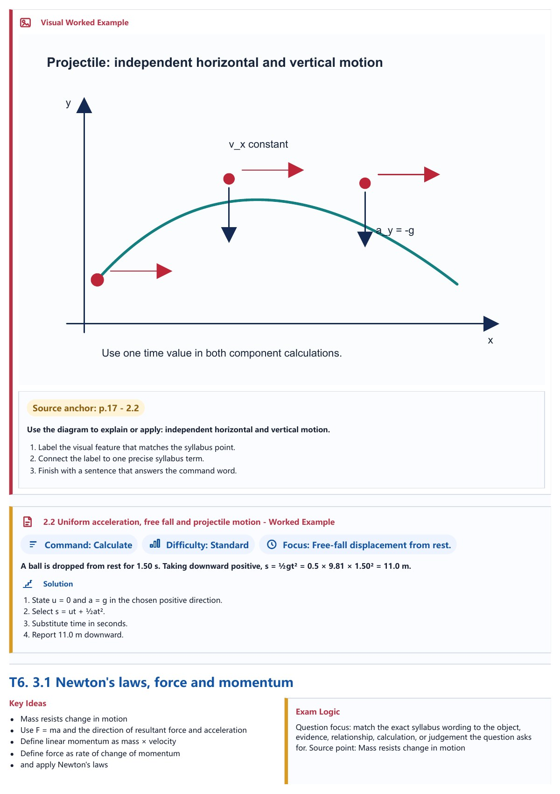</td>
    <td>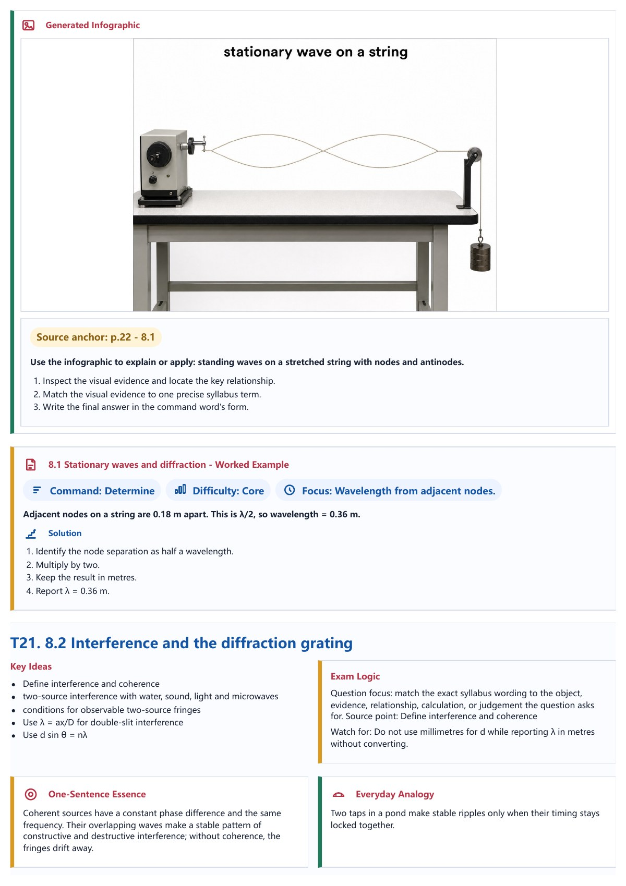</td>
    <td>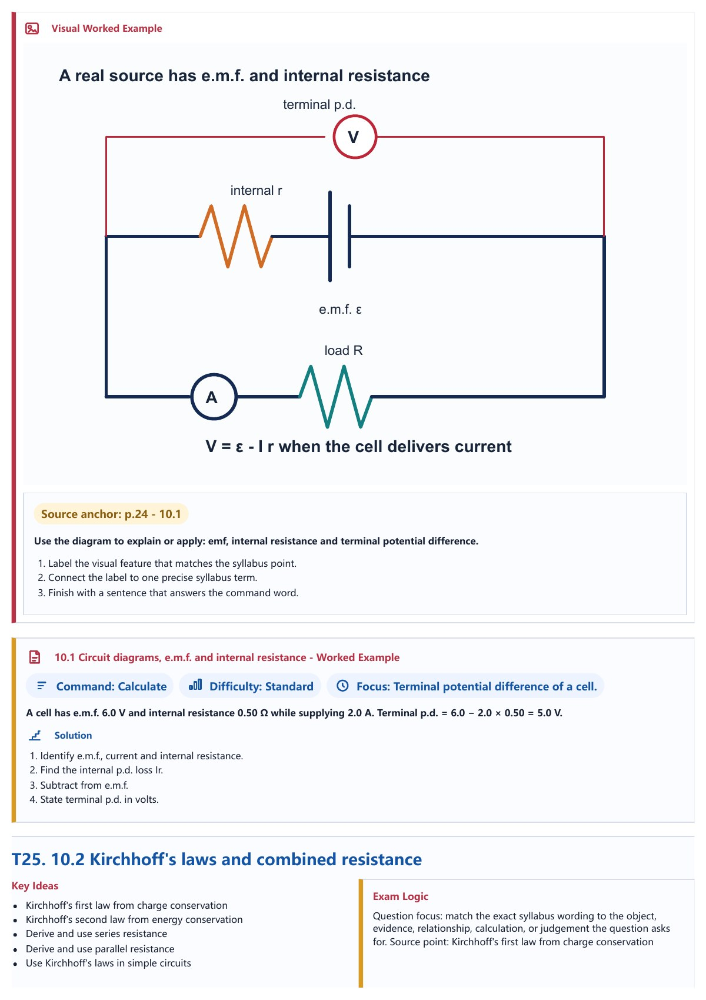</td>
  </tr>
</table>

### College Board AP Chemistry

<table align="center">
  <tr>
    <td>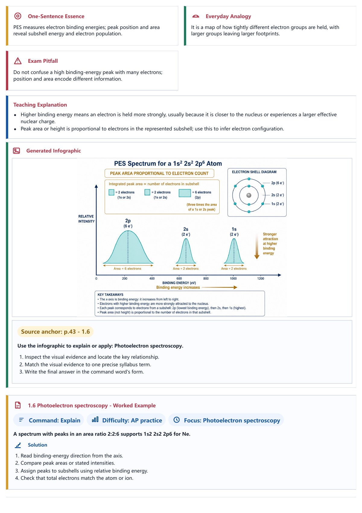</td>
    <td>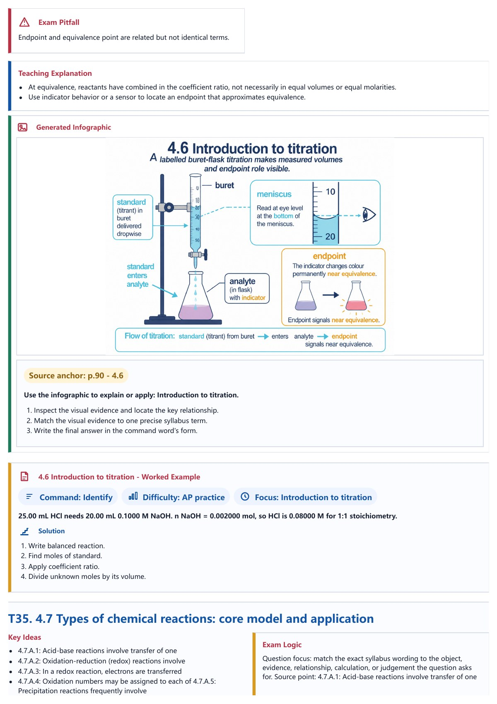</td>
    <td>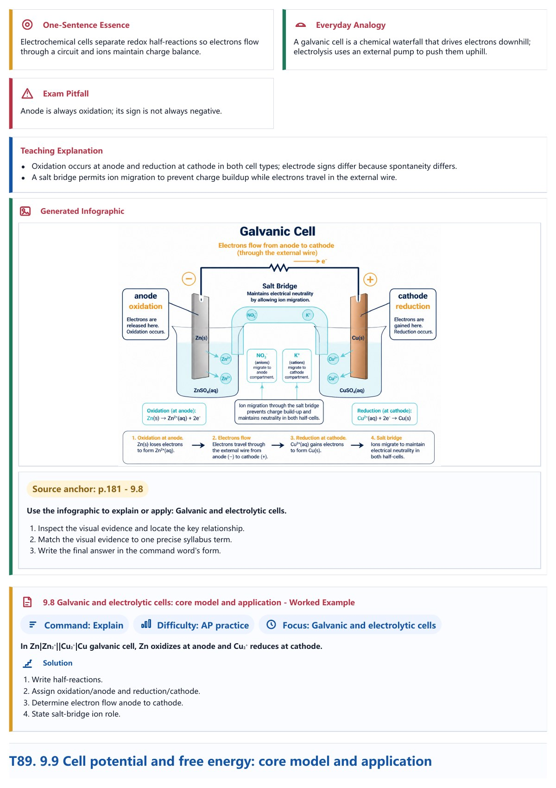</td>
  </tr>
</table>

### Pearson Edexcel International A Level Mathematics

<table align="center">
  <tr>
    <td>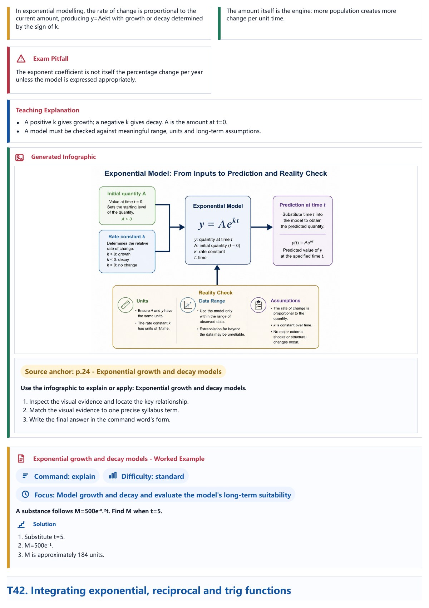</td>
    <td>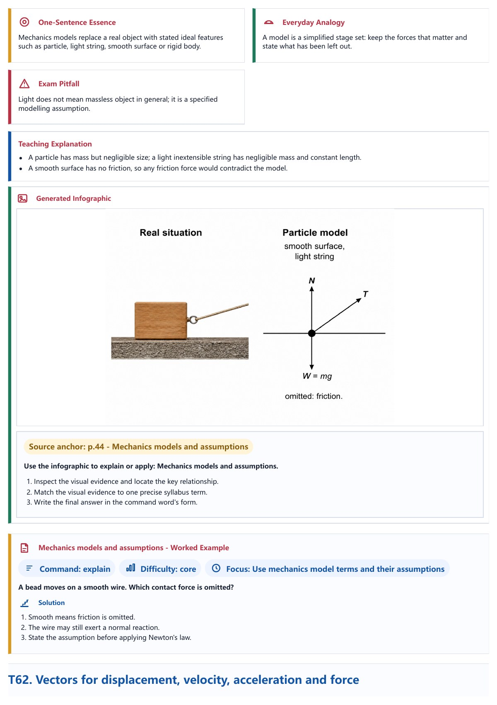</td>
    <td>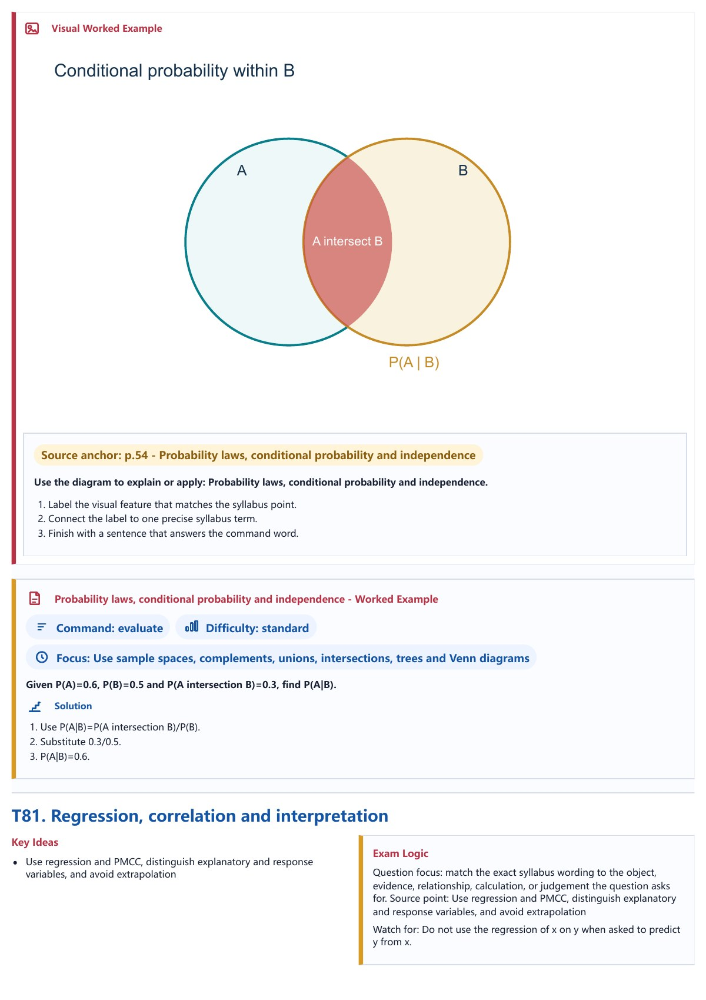</td>
  </tr>
</table>

这些页面来自四份分别完成拆纲、写作、配图、HTML 审查和 PDF 导出的当前手册，
用于展示版式与图文教学效果；它们不代表项目只支持这四门课，也不等于所有目录科目都已认证。

## 课程来源支持范围

| 课程路线 | AQA | Edexcel | CAIE | College Board |
|---|---:|---:|---:|---:|
| 英国本土 GCSE | 支持 | 支持 | 不支持 | 不支持 |
| 国际 IGCSE | 支持 | 支持 | 支持 | 不支持 |
| A-Level | 英国本土 / 国际 | 英国本土 / 国际 | Cambridge International | 不支持 |
| AP | 不支持 | 不支持 | 不支持 | 支持 |
| OCR、WJEC/Eduqas、CCEA 等其他英国考试局 | 暂不支持 | 暂不支持 | 暂不支持 | 不支持 |

项目当前支持上表列出的官方大纲自动获取路线。开始检索前，Agent 必须明确记录课程市场。
对 AQA 和 Edexcel，该选择决定所用的官方来源路线；对 CAIE，该选择记录请求的国际或英国考点
语境，但仍使用同一套 Cambridge International 官方目录。以上是来源工作流支持范围，不等于
所有科目都已有 final-ready 手册样例。其他考试体系或考试局不支持自动获取；手动导入仍可能遇到未知兼容错误。

交付质量以 `tests/fixtures/delivery_matrix.json` 里的交付矩阵为准。每条路线都有明确的
claim status 和 v0.6 release-evidence status；四个来源体系共享同一套生成流程，但不等于所有科目、
所有级别都已经验证。候选路线不能说成交付级，只有在新的输出同时通过 validation、
自己的全量 LLM HTML 审查、PDF 导出门禁和视觉状态检查，并写入 release-evidence manifest 后，才能升级为可交付样例。

v0.6 使用四个状态词：

- `candidate`：有路线或样例证据，但不是交付级。
- `draft`：有当前输出，但概念、图片、PDF、validation 或自查仍有阻塞。
- `final-ready`：当前证据显示这份手册已完成自己的全量 LLM HTML 审查，准确 topic/视觉覆盖和 HTML 哈希已记录，并通过 PDF 导出门禁；validation、概念和资产状态也没有阻塞。
- `certified`：在 final-ready 之上，又经过发布负责人或熟悉学科的人确认；除非证据 manifest 明确记录，否则不要称为 certified。

## 图文与讲解风格

孩子愿意看的手册不能只有文字。生成流程会做两次判断：

1. 先根据官方大纲生成知识点、讲解和例题。
2. 再判断哪些知识点或例题需要图文结合讲解。

宿主 LLM/Agent 判断每个 topic 到底需要纯文字、exact-SVG、Kroki 专业图，还是更复杂的信息图。这个判断适用于所有科目：任何科目都可能需要图，任何 topic 也都可以在理由充分时选择 `text-ok`。Writer 必须为每个 topic 写 `visual_decision`；如果选择 `text-ok`，必须写 `no_visual_reason` 说明为什么单独图片不会增加学习价值。SVG 只允许用于几何、坐标轴、标签、简单表格或简单流程能完整表达含义的场景；Writer 必须写明 `svg_fit="exact"`，并且资产经过 reviewed 或 approved 后才能进入最终交付。

如果用户没有可调用的生图模型，复杂视觉内容会保留在 `images/infographic_jobs.json` 和 `images/infographic_jobs.md` 中。Python 框架不会用本地 deterministic SVG 冒充复杂信息图。Kroki 或 SVG 输出只能作为已复核的 exact-fit 资产，不能替代高密度信息图。

推荐的外部生图模型包括：

- OpenAI GPT Image 2.0；
- Qwen Image 2.0 Pro；
- SenseNova U1 Fast。

这些只是推荐选项，不代表每个用户都能直接调用。用户需要自己提供可用的 API、Skill、脚本或图片目录。
生图只负责解释已经选中的知识点，不能编造大纲里没有的考试结论。

讲解风格也可以选择：严谨备考、轻松愉快、生活场景、故事化、侦探推理、闯关式等。
默认使用原创表达，不复刻受保护角色或世界观。

生成链路里也加入了一个轻量“反模板腔”检查：会先清理“总之”“综上所述”“值得注意的是”
这类安全可删的 AI 腔过渡语；如果仍然出现明显模板化表达，验证报告会给出 warning，方便后续复核。

设计参考说明：讲解文字的反模板腔检查借鉴了 `qiaomu-novel-generator` 里的 anti-AI language gate 思路。SVG 复核规则采用 figure contract 的原则：先写清楚图要解释的 claim、标签、来源依据和误导风险，再决定是否批准资产。这只是文档约束，不是运行时依赖。

## 语言策略

手册正文始终使用英文，因为考试本身是英文。生成前选择的是“术语辅助语言”，不是“整本手册翻译语言”：

- `en` 表示纯英文手册，不加术语表。
- `zh-CN`、`zh-TW`、`ja` 或其它受支持语言，会在英文正文基础上增加 30-50 个“用户语言 → English exam term”专业词对照表。
- 讲解正文、例题、标题、图中文字和生图提示词仍然使用英文。
- 不生成整本中文/日语正文，也不在正文里到处插入 `中文 / English` 这类拼接标签。

## 版本更新说明

版本更新说明统一放在 [GitHub Releases](https://github.com/mianbaofang/exam-revision-handbook/releases)
和 [CHANGELOG.md](CHANGELOG.md)。中文 README 只保留项目定位、使用方式和核心生成流程。

## 开发者快速开始

普通用户可以跳过这一节。下面的标准运行时命令只运行 evidence-only official run，
不代替 LLM 的大纲拆解、教学写作、配图判断或 HTML 审查。真正可教学的手册必须通过
Skill 宿主 LLM 完成完整流程。

```bash
python scripts/doctor.py
python scripts/run_runtime.py -- generate --query chemistry --level igcse --out ./outputs/chemistry-9202
```

Windows PowerShell：

```powershell
python scripts\doctor.py
python scripts\run_runtime.py -- generate --query chemistry --level igcse --out .\outputs\chemistry-9202
```

GitHub `main`、对应的 `v0.7.1` tag 和 Release 中的 Skill ZIP 就是同一个当前标准
Skill 版本，不存在单独的“源码版”或“安装版”。需要修改 Python 引擎的贡献者可使用
`pip install -e ".[dev]"`；ZIP 通过 `assets/runtime/` 中的受控 Wheel 和独立用户缓存运行。

常用检查：

```bash
python -m pytest --cov --cov-report=term-missing --cov-fail-under=70 -q
python -m ruff check .
python -m compileall -q src tests scripts
python scripts/scan_for_raw_keys.py . ./outputs
```

## 目录结构

```text
SKILL.md         唯一权威 Agent 入口
agents/          各平台的 Skill 元数据
references/      完整工作流、产物、Provider 与运行时合同
assets/runtime/  固定版本的 Python 引擎 Wheel 与完整性锁
evals/           触发、工作流、迁移与输出一致性样例
reports/         标准 Skill 与迁移验证证据
security/        运行权限和网络策略
skill_atlas/     路由与维护元数据
scripts/         运行适配器、导入助手和项目维护工具
src/intl_exam_guide/
  providers/      各考试局官方页面读取与解析
  parsing/        PDF 文本抽取
  planning/       知识点、例题和配图需求规划
  rendering/      HTML 与 PDF 渲染
  validation/     完整性检查
docs/             项目详情、准确性政策、示例和展示页面
tests/            测试与回归样例
```

维护或交接项目前，请先阅读 [PROJECT.md](PROJECT.md)。

## 安全与来源边界

不要把下载的官方 PDF、past papers、mark schemes 或复制来的真题内容提交到仓库。
公开样例应使用原创讲解、原创练习卡和必要的来源信息。

给孩子正式备考使用前，建议由老师或熟悉大纲的人复核深度例题和答案。

## 致谢

这个项目建立在公开考试局资料、开源工具和 Agent 工作流方法之上：

- 官方公开大纲页面和 PDF：OxfordAQA / Oxford International AQA、Pearson Edexcel、Cambridge International。
- PDF 与文档处理：`pypdf`，以及宿主工作流可用时的 Microsoft [`markitdown`](https://github.com/microsoft/markitdown)。
- 渲染和验证工具：Playwright、pytest、pytest-cov、Ruff、mypy。
- 演示与视觉链路：HyperFrames、生成预览素材，以及用户或宿主运行环境提供的生图路线。
- 写作质量参考：反模板腔检查借鉴 `qiaomu-novel-generator` 的风格规则。

考试局名称只用于说明来源，不表示本项目获得这些考试局背书、合作或认证。

完整的非关联声明、版权边界和引用来源见 [DISCLAIMER.md](DISCLAIMER.md) 与 [ACKNOWLEDGEMENTS.md](ACKNOWLEDGEMENTS.md)。

## 状态

当前 Skill 版本：`v0.7.1`。这个 Skill 已具备公开使用的框架形态；单份手册只有在完成自己的全量 LLM HTML 审查、写入与当前 HTML 绑定的 `agent-product-review.json`、通过 PDF 导出门禁，并具备相应发布证据后，才能称为 final-ready。

## 作者

Ethan <ethan.zl@hotmail.com>

## HTML 审查与 PDF 导出顺序

最终交付前必须先只生成 HTML，不提前生成 PDF。宿主 LLM 必须亲自打开或截图查看当前 HTML；`validation.json`、`quality-inspection.json`、`final-review-packet.json` 和其他 Python 检查只能作为辅助信息，不能代替 LLM 的可视化审查，也不能自动给出通过结论。

如果 LLM 在内容、考点覆盖、例题、配图、排版、溢出、符号或语言方面发现问题，必须返回 Writer 重写相应源文件，重新渲染 HTML，并由 LLM 再次完整查看。这个“重写 -> 渲染 -> 亲自查看”的循环要持续到当前 HTML 没有可修复问题。

通过后，LLM 在 `agent-product-review.json` 中记录 `reviewer_type: "llm"`、当前 HTML 的 SHA-256、审查轮次和 `decision: "approved"`。然后才可运行：

```bash
python scripts/run_runtime.py -- export-pdf --out <output-dir>
```

HTML 一旦再次改变，原审查记录立即失效，必须重新查看和审批后才能再次导出 PDF。

## License

MIT.
