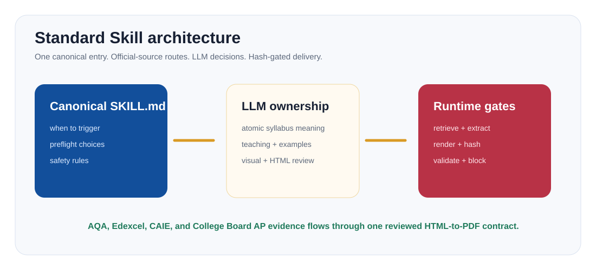
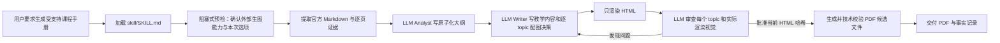

# Skill Explained / Skill 图解说明

<p align="center">
  
</p>

## English

The authoritative Agent entry is `skill/SKILL.md`. Its references provide the
handbook contract and provider notes:

- `skill/references/revision_guide_spec.md`: artifact and delivery contract;
- `skill/references/oxfordaqa.md`: AQA-specific source notes;
- `skill/references/collegeboard-ap.md`: AP directory, CED, and effective-version rules;
- Edexcel and CAIE use the shared provider and candidate-confirmation workflow.

The host LLM owns syllabus interpretation, teaching content, worked examples,
per-topic visual judgment, and final visible review. Python performs mechanical
work: source acquisition, evidence extraction, artifact validation, rendering,
hashing, and enforcement of the recorded LLM decision.

## Skill Workflow

```mermaid
flowchart LR
  A["User requests a supported handbook"] --> B["Load skill/SKILL.md"]
  B --> C["Blocking preflight: confirm external image capability and run choices"]
  C --> D["Extract official Markdown and page evidence"]
  D --> E["LLM Analyst writes atomic syllabus outline"]
  E --> F["LLM Writer writes teaching content and per-topic visual decisions"]
  F --> G["Render HTML only"]
  G --> H["LLM reviews every topic and rendered visual"]
  H -->|"issues"| F
  H -->|"approved exact HTML hash"| I["Render and validate PDF candidate"]
  I --> J["Write current-pdf record and controlled delivery copy"]
```



The initial image question is about capability, not model preference: **Can the
user provide or enable a callable external image-generation Skill or tool for
this run?** The Agent must wait for the answer and must not silently default to
local generation. Actual visual jobs are still chosen later, independently for
each final topic.

## Completion Gates

A handbook is not final unless all applicable gates pass:

1. Official source identity is verified, or an unsupported manual import is explicitly described as experimental.
2. The LLM Analyst reads both Markdown structure and page-level evidence and writes source-backed, independently assessable syllabus points.
3. The LLM Writer supplies teaching content, worked answers, `mastery_summary`, and one `visual_decision` for every final topic.
4. Rendered visuals are real reviewed assets; pending complex visuals remain draft work.
5. The current HTML exists and no PDF has been generated for that HTML before approval.
6. The active LLM personally reviews every final topic, worked example, answer, source anchor, and rendered visual, repairing and rerendering until no fixable issue remains.
7. LLM-authored `review-ledger/` shards cover every current Topic/Visual ID, record visible evidence locations, and bind to the render snapshot and HTML SHA-256; compact `agent-product-review.json` uses `v0.7-llm-html-review-ledger` and references the ledger hash.
8. `python -m intl_exam_guide export-pdf --out <output-dir>` promotes only a technically valid candidate and writes `current-pdf.json` after approval.

`validation.json`, `quality-inspection.json`, and `final-review-packet.json` are
supporting diagnostics. They cannot approve content or replace visible review.

For an installation smoke check only:

```bash
python -m intl_exam_guide demo --out ./outputs/demo-science --language en --image-provider prompt-queue --explanation-style friendly --skip-pdf
```

The demo stops at HTML and is not a teaching-grade handbook.

## 中文

Agent 的唯一权威入口是 `skill/SKILL.md`。相关 reference 分别保存手册交付合同和来源说明：

- `skill/references/revision_guide_spec.md`：产物与交付合同；
- `skill/references/oxfordaqa.md`：AQA 来源说明；
- `skill/references/collegeboard-ap.md`：AP 课程目录、CED 与生效版本规则；
- Edexcel 和 CAIE 使用共享 provider 与候选确认流程。

宿主 LLM 负责解释大纲、编写教学内容与例题、逐 topic 做配图判断，并亲自完成最终可视审查。Python 只负责抓取来源、提取证据、校验产物结构、渲染、计算哈希和执行已记录的 LLM 决定。

## Skill 执行流程



第一次生图问题只确认“有没有可调用能力”，不是让用户先选具体模型。Agent 必须等待明确回答，不能默认使用本地生图。实际需要哪些视觉，要等 Writer 完成每个最终 topic 的独立判断后再确定。

## 完成门槛

除非所有适用门槛都满足，否则手册不能称为最终成品：

1. 官方来源身份已经核实；不受支持的手动导入必须明确标为实验性路径。
2. LLM Analyst 同时读取 Markdown 结构和逐页证据，写出有来源、可独立考查的考点。
3. LLM Writer 为每个最终 topic 写完整教学内容、例题答案、`mastery_summary` 和一份 `visual_decision`。
4. 实际渲染视觉必须是已复核资产；复杂视觉仍 pending 时只能算 draft。
5. 当前 HTML 已生成，而且在它通过审查前没有提前生成 PDF。
6. 当前 LLM 逐一审查所有最终 topic、例题、答案、来源锚点和实际渲染视觉；发现问题后重写、重渲染、重新完整查看，直到没有可修复问题。
7. LLM 编写的 `review-ledger/` 分片逐项覆盖当前 Topic/Visual ID，记录可见审查位置，并绑定渲染快照与 HTML SHA-256；精简的 `agent-product-review.json` 使用 `v0.7-llm-html-review-ledger` 并引用账本哈希。
8. 审查通过后，`python -m intl_exam_guide export-pdf --out <output-dir>` 只提升通过技术检查的候选 PDF，并写入 `current-pdf.json`。

`validation.json`、`quality-inspection.json` 和 `final-review-packet.json` 只是辅助诊断，不能代替 LLM 的可视审查，也不能自动批准手册。
